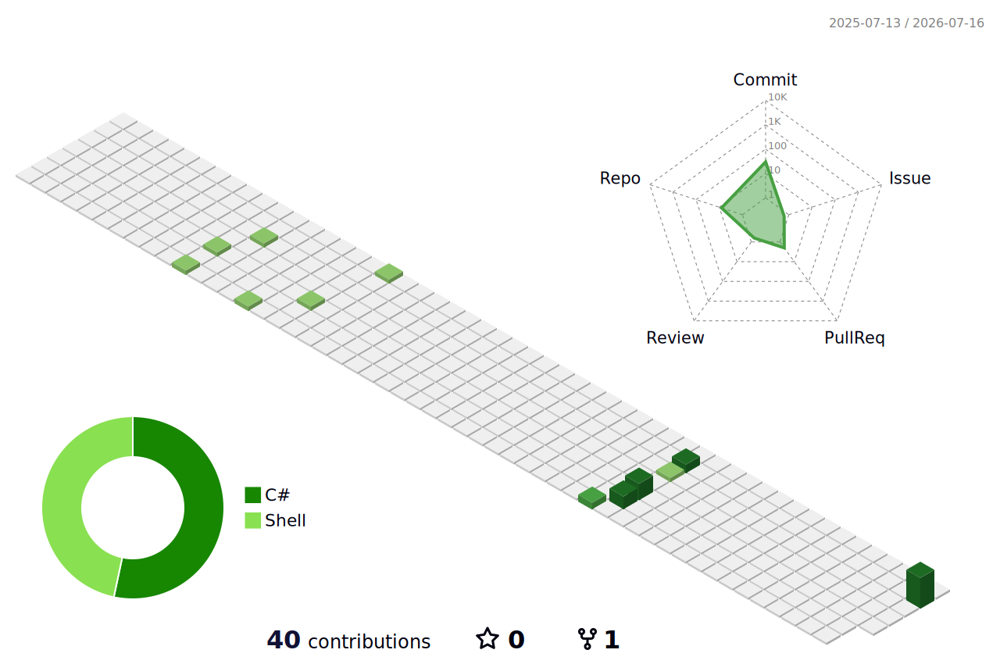
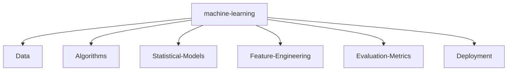

<!--   my-icons -->
<p align="center">
    <a href="https://github.com/reinrein111/reinrein111"></a>
    <a href="https://github.com/python/cpython"></a>
    <a href="https://github.com/reinrein111/reinrein111/graphs/contributors"></a>
    <a href="https://github.com/reinrein111/reinrein111/stargazers"></a>
    <a href="https://github.com/reinrein111/reinrein111/network/members"></a>
       
</p>

<!--   my-header-img -->


<!--   my-ticker -->    
[](https://git.io/typing-svg)


<!--   my-skils -->

| Property                                        | Data                                                                                                                                                                                                                                                                                                                                                                                                                                                                                                                                                                                                                                                                                                                                                                                                                                                                                                                                                                                                                                                                                                                                                                                                                                                                                                                                                                                                                                                                                                                                                                                                                                                                                                                                                                                                                                                                                                                                                                  |
|-------------------------------------------------|-----------------------------------------------------------------------------------------------------------------------------------------------------------------------------------------------------------------------------------------------------------------------------------------------------------------------------------------------------------------------------------------------------------------------------------------------------------------------------------------------------------------------------------------------------------------------------------------------------------------------------------------------------------------------------------------------------------------------------------------------------------------------------------------------------------------------------------------------------------------------------------------------------------------------------------------------------------------------------------------------------------------------------------------------------------------------------------------------------------------------------------------------------------------------------------------------------------------------------------------------------------------------------------------------------------------------------------------------------------------------------------------------------------------------------------------------------------------------------------------------------------------------------------------------------------------------------------------------------------------------------------------------------------------------------------------------------------------------------------------------------------------------------------------------------------------------------------------------------------------------------------------------------------------------------------------------------------------------|
| **Language / IDE**                              |     &nbsp; &nbsp; &nbsp; &nbsp;                                                                                                                                                                                                                                                                                                                                                                                                                                                                                                                                                                                                                                                                                                                                                                                                                                                                                                                                                                                                                                                                                                                                                                                                                                                                                                    |
| **Domain Knownledge**                           | [](https://github.com/reinrein111/reinrein111) [](https://github.com/search?q=user%3Areinrein111&type=Repositories) [](https://github.com/search?q=user%3Areinrein111&type=Repositories) [](https://github.com/search?q=user%3Areinrein111&type=Repositories)                                                                                                                                                                                                                                                                                                                                                                                                                                                                                                                                                                                                                                                                                                                                                                                                                                                                                                                                                                                                                                                                                                                                                                                                                                            |
| **CI / CD**                                     | [](https://github.com/reinrein111/reinrein111) &nbsp; &nbsp; &nbsp;  [](https://www.docker.com) [](https://www.jetbrains.com/pycharm/) [](https://code.visualstudio.com)|
| **Databases**                                   | &nbsp; &nbsp; [](https://www.postgresql.org)                                                                                                                                                                                                                                                                                                                                                                                                                                                                                                                                                                                                                                                                                                                                                                                                                                                                                                                                                                                                                                                                                                                                                                                                                                                                                                                                                                                                                                                                                                                                                                                                                                                                                                                                                                                                 |
| **Machine Learning / Deep Learning frameworks** | ![Jupyter Notebook](http://img.shields.io/badge/-Jupyter%20Notebook-eee?style=flat-square&logo=data:image/png;base64,iVBORw0KGgoAAAANSUhEUgAAAA4AAAAQCAMAAAARSr4IAAACGVBMVEVhYmJdYWT/fBfzdyaqdlV2dnfcdC9udnz5dyKUaU3wdicCO2CzZzVdUkpOTk5MTk60ZzUAAP/XcC3fcivgciv/lArAajLqdSifYjrydyajnJjEjWifnp3FjGcAAACenp52dnd2dnd2dndhYmJhYmIxW3bzdybzdybzdybzdybzdyb/dxpydnl2dnd2dndhYmJgYmOda0r0dyXzdybzdybzdybudymQdmZldoJQYGmRaU7ydyfzdybzdybzdybzdybzdybzdybzdyb1dyX9dx/2dyXzdybzdybzdyb+eiPzdybzdybzdyb/ghz8eSQ3SFT/tABNTk5HTFBMTk5OTk5OTk5OTk5OTk5OTk5OTk5OTk5OTk5NTk5GTFBOTk5OTk5OTk5OTk5OTk5OTk5OTk5OTk5OTk5OTk5OTk5OTk5OTk5OTk5OTk5NTk5OTk5OTk5OTk5OTk5OTk5OTk5OTk5OTk5NTk5NTk5UUEx5WUMAOGRMTU9OTk5OTk5OTk5OTk5OTk5FTFAXQFvBajK8aTP2eCX0dyb0dyb0dybzdyb4eCXzdybzdybzdybzdybzdybzdybzdybzdybzdyb6dB3zdyXzdybzdybzdybzdybzdybzdybzdyaenp6cn6HKimD0dyXzdybzdybzdybzdybzdybzdyaenp6enp6dn6Dzdybzdyaenp6enp6enp6enp7zdyaenp7///9F1GYlAAAAsHRSTlMAAAAAAAAAAAAAAAAAAAAAAAAAAAAAAAAAAAAAAAAAADHCVho4Ax1RcnFOFz/ibFmwHXPc/thwKwkKJpfbqn1oaX+uighRdSIDAyV6TAQcAgIVHBMbKjIgEzBTHCsbLUBdQlhiTWBlR1xkaEVIR1tPbFEvF0pJNR9AFAQIMwgfKQUDBwgDBEsuMkcCLLSUKBsqT5iwNcX47N/g7cAxPmUqZq/OzaxiExPJYgQPCJjcP9lVnrgAAAClSURBVAjXVcyxSoIBAEXh+xkhEkFr6hD0AM5BkbQ3ODaEY4uDSENCS1BThI/h4v4TERG0NzZHvoAQ0SDV8FvkmS6cw5UgSTR5s83rlgUvWuA8l/Bs59eYbXhS28VdUt1H4dA9Eu1HexUdS3T/7Y81vXJ9rQicLcxoAK64hvd1fWwOeDgoy+JW3bCs56tOonnxd3ycGKt9nt7I91GShgn60yRJI/kBP8EfEEdOa6sAAAAASUVORK5CYII=&logoColor=F37626)    &nbsp; &nbsp; |


<!--   GitHub stats graph -->
### 📈 GitHub Activity Graph:

<!--   green snake -->

<!--   stats + languages -->
| .                                                                                                                                       | .                                                                                                                         |
|-----------------------------------------------------------------------------------------------------------------------------------------|---------------------------------------------------------------------------------------------------------------------------|
|  |  |


</img>

<!-- dark snake -->


<!--   profile-green-animate -->


<!--   grid-snake  -->


<!--   skyline 
<a href="https://skyline.github.com/reinrein111/2022"></a>
-->

<!--  TOP codersrank -->
</img>
<!--  2d history skills -->
</img>

**📫 How to Reach me:**
<p align="left">
<a href="https://twitter.com/" target="blank"></a>
<a href="https://linkedin.com/in/" target="blank"></a>
<a href="mailto:your-email@gmail.com" target="blank"></a>
</p>

<div align="center">
<summary>Trophy: Github Profile Trophy</summary>
</div>

<p align="center"> 
<a href="https://github.com/ryo-ma/github-profile-trophy"></a>
</p>


   <!--machine-learning-->

   


 


<!-- My Home-->
 
 ```geojson
{
 "type": "FeatureCollection",
 "features": [
   {
     "type": "Feature",
     "id": 1,
     "properties": {
       "ID": 0
     },
     "geometry": {
       "type": "Polygon",
       "coordinates": [
         [
             [23.5,53.9],
             [23.5,51.2],
             [32.7,51.2],
             [32.7,53.9],
             [23.5,53.9]
         ]
       ]
     }
   }
 ]
}
```
   

<!--  TOP codewars -->
<!-- </img> -->

<p align="center"> 
  Visitor count<br>
  
</p>


